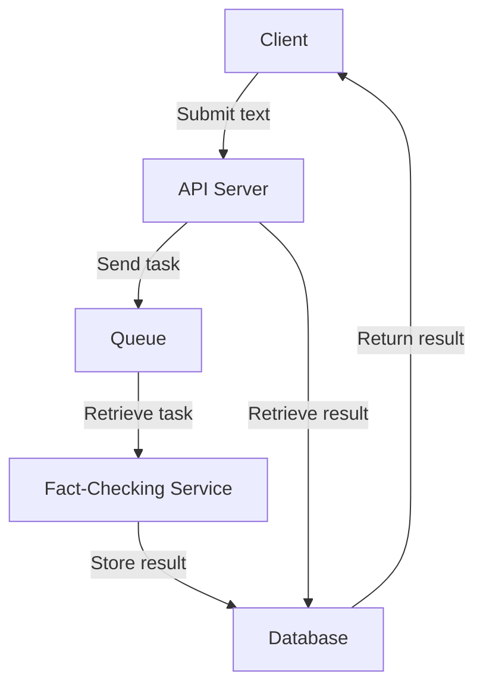

# System Architecture

This document describes the overall architecture of the Fact Checker system.

## Overview

The Fact Checker system is designed to perform fact-checking on given texts. The system consists of the following components:

1. **API Server**: Receives fact-checking requests and returns the results.
2. **Queue**: Stores fact-checking tasks.
3. **Fact-Checking Service**: Processes the fact-checking tasks and classifies the results.
4. **Database**: Stores the fact-checking results.

## Components

### API Server

The API server is implemented using AWS Lambda functions. It provides two main endpoints:

- `POST /fact-check`: Submits a text for fact-checking.
- `GET /fact-check/{id}`: Retrieves the fact-checking result for a given ID.

The API server handles incoming requests, sends tasks to the queue, and retrieves results from the database.

### Queue

The queue is implemented using Amazon SQS (Simple Queue Service). It stores the fact-checking tasks and ensures that they are processed in a reliable and scalable manner.

### Fact-Checking Service

The fact-checking service is responsible for processing the tasks from the queue. It performs the actual fact-checking and classifies the results into four categories: accurate, inaccurate, false, and indeterminate. The results are then stored in the database.

### Database

The database is implemented using Amazon DynamoDB. It stores the fact-checking results and allows the API server to retrieve them using the task ID.

## Architecture Diagram

The following diagram illustrates the overall architecture of the Fact Checker system:

## AWS Resources

The following AWS resources are used in the Fact Checker system:

- **AWS Lambda**: Implements the API server and fact-checking service.
- **Amazon SQS**: Implements the queue for storing fact-checking tasks.
- **Amazon DynamoDB**: Implements the database for storing fact-checking results.
- **AWS API Gateway**: Provides the API endpoints for the API server.

## Deployment

The infrastructure for the Fact Checker system is defined using Terraform. The following Terraform files are used:

- `main.tf`: Defines the AWS resources for the API server, queue, and fact-checking service.
- `variables.tf`: Defines variables for AWS region, queue name, and other configurations.
- `outputs.tf`: Defines outputs for the API endpoint and other relevant information.

## Conclusion

The Fact Checker system is designed to be scalable, reliable, and easy to deploy. By using AWS services such as Lambda, SQS, and DynamoDB, the system can handle a large number of fact-checking requests and provide accurate results in a timely manner.
